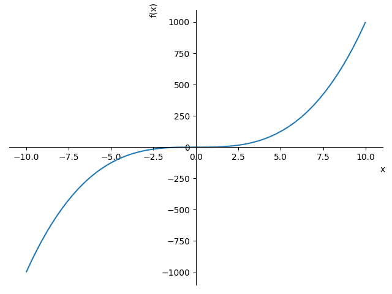

<!--documentclass: report -->
\newpage 

# Ejercicio 7   

Sea la curva $\alpha : \R \longrightarrow \R ^2$ dada por $\al = (t, t^3)$, para todo $t \in \R$.  
(a) Comprueba que es regular.  

(b) Prueba que $\kl = \frac{6t}{(1+9t^4 ) ^ {\frac{3}{2}}}$ y que, en particular $\kl = -k(-t)$ para todo $\ptt$.   

(c) Observa que la $Img(\alpha)$ es simétrica respecto del punto $\alpha(0)$ (es decir, que el giro de centro $\alpha(0)$ y el 
ángulo $\pi$ deja a $Img(\alpha)$ invariante).   

(d) Motivado por lo anterior, si $\alpha: (- \epsilon, \epsilon ) \longrightarrow \R ^2$ con  $\epsilon > 0$ o $\epsilon > \infty$,
es una curva regula cuya curvatura cumple que $\kl = -k(-t)$ para todo $t \in (- \epsilon, \epsilon )$, ¿podemos afirmar que 
$Img(\alpha)$ es simétrica respecto del punto $\alpha(0)$.   

## a) Regularidad 

Se tiene que $\al ' = (1, 3t^2)$ que no se anula sea cual sea $t \in \R$ gracias a su primera componente, luego es regular. 

## b) Cálculo de su curvatura y ver que es impar.  

Para este aparatado veremos que $\al$ es la parametrización natural de la gráfica de la función cúbica $f(x) = x^3$. 

Esto es $\al = (t, f(t))$
  

Además para este tipo de curvas conocemos la siguiente expresión para calcular su curvatura

$$ \kl = \frac{f''(t)}{ (1+ f'(t)^2 ) ^{\frac{3}{2}}}$$
luego como $f'(t) = 3 t^2$ y   $f''(t) = 6 t$, podemos concluir que 

$$ \kl = \frac{ 6t}{ (1+ 9t^4 ) ^{\frac{3}{2}}}$$  

como se quería probar. 

Finalmente veamos que independientemente del valor de $\ptt$

$$- k(-t) =  -\frac{ 6(-t)}{ (1+ 9(-t)^4 ) ^{\frac{3}{2}}} = \frac{ 6t}{ (1+ 9t^4 ) ^{\frac{3}{2}}} = \kl.$$ 

## c) Simetría de  $Img(\alpha)$ respecto del punto $\alpha(0)$  

Sea $G(x,y)=(-x,-y)$ para todo $t \in \R ^2$ el giro de $\pi$ radianes respecto del origen 
(o quivalentemente la simetría respecto a la recta $y=-x$). 

Observemos que $G \al = G (t, t^3) = (-t,-t^3) = \alpha( -t)$, es decir, que el giro lo deja invariante 
como queríamos ver.   

## d) Simetría de la imagen por paridad de la función curvatura   

Como hipótesis tenemos una curva  $\alpha: (- \epsilon, \epsilon ) \longrightarrow \R ^2$ regular, que aemá su curvatura cumple 
$\kl = -k(-t).$  

Consideremos el movimiento rígido $M$ de $\R ^2$  que cumple que $M(\alpha(0)) = (0,0)$, que $\overrightarrow{M}_{e_1(0)} = (1,0)$ y 
 que $\overrightarrow{M}_{e_2(0)} = (0,1)$.  
 
 Luego la curva $M \circ \alpha :(- \epsilon, \epsilon ) \longrightarrow \R ^2$ es regular y congruente con $\alpha$, cumple además que
 que $e ^{M \circ \alpha}_1(0) = (1,0)$ y $e ^{M \circ \alpha}_2(0) = (0,1)$
 Si probamos que 
 
 \begin{equation}
 S(M \circ \alpha (t)) \text{ para todo }t, 
 \end{equation}

siendo $G$ la aplicación giro definida en el apartado anterior, tendríamos que $Im(\alpha( M \circ \alpha)$ es simétrica respecto al origen.  

Por tanto $M^{-1} \circ G \circ M \circ \alpha (-t) = \al,$  $M^{-1} \circ G \circ M$ es un giro respecto a una recta $L$   
